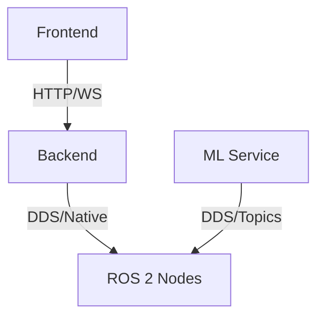

# Multi-Layer Robotics Platform

I have designed this system as a production-grade fleet management platform. It enforces a strict separation of concerns, simulating a real-world robotics deployment environment.

## System Prerequisites (WSL 2 Only)

**WARNING**: This project uses a hybrid workflow. ROS 2 commands **must** run in WSL 2 or Docker.

### 1. Required Tooling

- **WSL 2** (Ubuntu 22.04 recommended)
- **Bun** (Node.js Alternative)
- **UV** (Python Package Manager)
- **ROS 2 Humble** (Installed in WSL)
- **Docker Desktop** (With WSL 2 backend enabled)

### 2. Accessing the Environment

**From Windows:**

1.  Open PowerShell.
2.  Type `wsl` and hit Enter.
3.  Navigate to the project directory:
    ```bash
    cd ~/projects/ros2-robot-stack
    ```

### 3. Initialization & Build Strategy

We use `bun` as the universal task runner to orchestrate the build process.

```bash
# 1. Install all dependencies (Frontend, Backend, Shared)
bun install

# 2. Setup Python environment for ML Service
cd apps/ml-service
uv venv
source .venv/bin/activate
uv pip install -r requirements.txt

# 3. Return to root and compile artifacts
cd ../..
bun run build:all
```

### 4. Runtime Execution Guide

I execute each service in a separate terminal tab (inside WSL) to simulate microservices.

**Terminal 1: Infrastructure**

```bash
cd infra
docker compose up -d postgres redis
```

**Terminal 2: Backend (Orchestrator)**

```bash
cd apps/backend
bun run dev
```

**Terminal 3: Frontend (Dashboard)**

```bash
cd apps/frontend
bun run dev
```

**Terminal 4: ML Service (Vision)**

```bash
cd apps/ml-service
source .venv/bin/activate
uvicorn main:app --reload
```

**Terminal 5: ROS 2 Simulation (Physics)**

```bash
cd robotics/ros2_ws
source /opt/ros/humble/setup.bash
colcon build
source install/setup.bash
ros2 launch simulation_manager main.launch.py
```

## Architecture Overview

| Service        | Location           | Runtime       | Purpose                   |
| :------------- | :----------------- | :------------ | :------------------------ |
| **Frontend**   | `apps/frontend`    | Next.js (Bun) | Operator Dashboard        |
| **Backend**    | `apps/backend`     | Node.js (Bun) | Auth, API, Robot Registry |
| **ML Service** | `apps/ml-service`  | Python (UV)   | Vision & Inference        |
| **Robotics**   | `robotics/ros2_ws` | ROS 2 Humble  | Simulation & Control      |
| **Shared**     | `packages/`        | TypeScript    | Source of Truth for Types |

## Connectivity Model

All services run inside the **Same Network Namespace** (localhost) when using WSL 2.



This mimics a production cluster where services talk over a private mesh network.
